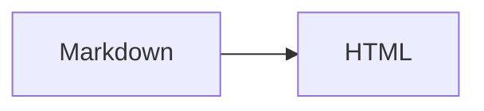

# miel.ing 개발 블로그

Astro로 생성하는 정적 기술 문서 블로그입니다. 글의 원본은 `content/posts/`의 Markdown 파일입니다.

## 실행

```sh
npm install
npm run dev
npm run check
npm run build
npm run preview
```

Mermaid 다이어그램을 새로 추가하거나 수정할 때는 빌드 전에 한 번 브라우저 실행 파일을 설치합니다.

```sh
npx puppeteer browsers install chrome-headless-shell
```

기존 다이어그램의 생성된 SVG는 저장소에 포함되어 있어 일반 빌드에서는 이 설치가 필요하지 않습니다.

## 글 발행

1. `templates/post.md`를 `content/posts/원하는파일명.md`로 복사합니다.
2. 제목, 설명, 태그, 날짜와 본문을 직접 작성합니다.
3. `postId`는 한 번 발행한 뒤 바꾸지 않습니다. `slug`를 바꾸면 이전 값을 `aliases`에 넣습니다.
4. 글을 공개할 때 `draft: false`로 바꾸고 `npm run build`를 확인합니다.

`postId`, `slug`, `aliases`에는 소문자 영문·숫자·하이픈을 사용합니다. 초안은 글 목록, 태그 페이지, RSS, sitemap, 글 경로 어디에도 출력되지 않습니다.

주소는 `/posts/{postId}/{slug}/`입니다. `aliases`는 정적 리디렉션 HTML을 생성합니다. 실제 HTTP 301 응답을 적용하려면 배포 호스트의 리디렉션 규칙이 필요합니다.

사이트 이름과 설명은 `src/site.ts`, 도메인은 `astro.config.mjs`와 `public/robots.txt`에서 관리합니다.

## 문서 표현

실제 렌더링 예시는 [문서 표현 실험실](content/posts/document-showcase.md)에 있습니다. 글 본문에서는 표준 Markdown의 목록, 인용, 표, 각주, 이미지, 코드 블록을 사용할 수 있습니다. 제목의 목차와 고정 링크는 빌드 중 생성됩니다.

코드 블록에 파일 이름을 붙일 때는 `title` 또는 `filename`을 사용합니다.

````md
```ts title="src/example.ts"
const answer = 42;
```
````

콜아웃은 `note`, `tip`, `warning`, `danger` 톤을 지원합니다.

```md
:::callout{tone="tip" title="작성 팁"}
짧은 보충 설명을 적습니다.
:::
```

설명이 붙은 최적화 이미지는 PNG 또는 JPEG 원본을 `content/posts/` 안에 두고 상대 경로로 지정합니다. 빌드에서 AVIF, WebP와 원본 대체 이미지를 만들며 크기와 대체 텍스트를 출력합니다. 일반 Markdown 이미지도 사용할 수 있습니다.

```md
::figure{src="./assets/diagram.png" alt="다이어그램 설명" caption="그림 1. 흐름"}
```

Mermaid는 `mermaid` 코드 블록으로 작성하며 빌드에서 정적 SVG로 변환합니다. 다이어그램을 수정한 뒤에는 `npm run build`로 결과를 확인합니다.

````md

````

글 목록, 태그, [아카이브](src/pages/archive/index.astro), RSS와 sitemap은 공개 글만 포함합니다. 이전 글과 다음 글도 공개 글 기준으로 연결됩니다.

## 배포

`main`에 push하면 [GitHub Actions](.github/workflows/deploy.yml)가 Astro를 빌드하고 GitHub Pages에 배포합니다. 공개 주소는 `https://blog.miel.ing`이며, Pages 설정에서 GitHub Actions를 게시 소스로 선택하고 사용자 지정 도메인도 같은 주소로 지정해야 합니다. Cloudflare DNS의 `blog` CNAME은 `ynifamily3.github.io`를 가리키도록 설정합니다. `public/CNAME`은 배포 결과에도 포함되지만 Actions 배포의 Pages 도메인 설정을 대신하지 않습니다.

현재 사이트는 정적 페이지로 완결됩니다. 나중에 댓글을 구현할 때는 별도 서버 또는 edge function이 동적 요청을 처리하도록 분리합니다. GitHub Pages 자체에는 서버 실행 기능이 없습니다.

## 이후 단계

- Phase 2: 정적 검색, 분석
- Phase 3: 별도 동적 댓글 페이지와 기본 HTML 폼
- Phase 4: 글별 Git revision과 정적 과거 버전 페이지

본문에는 클라이언트 JavaScript가 필요하지 않도록 유지합니다.
