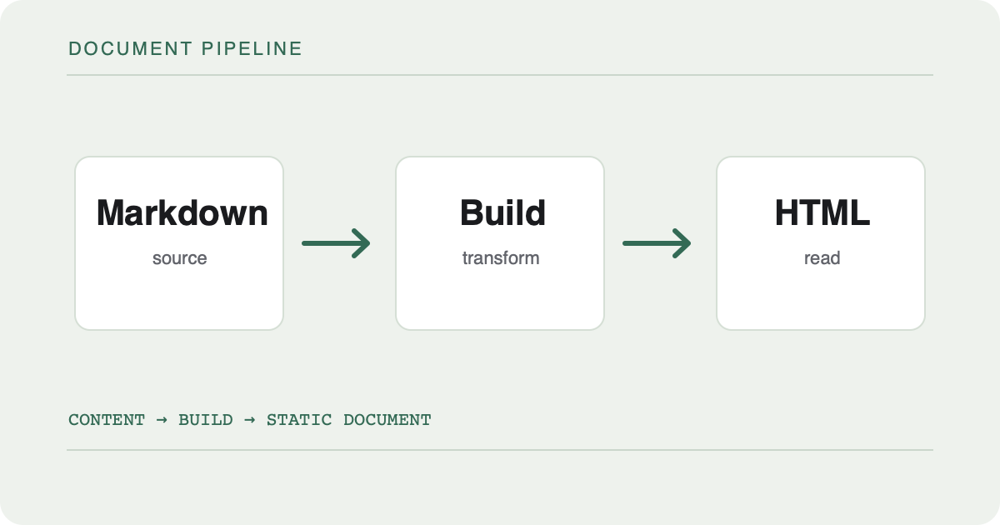
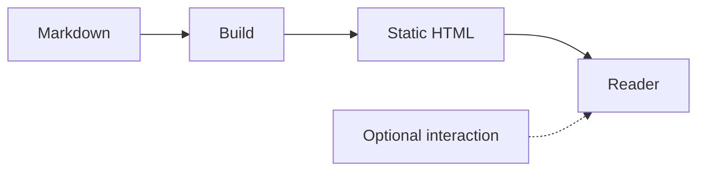

이 글은 특정 주제를 설명하기보다 **문서가 다양한 정보를 어떻게 보여 주는지** 시험한다. 긴 문장, 짧은 문장, 인라인 코드, 목록, 표, 이미지가 한 페이지 안에서 만났을 때 읽기 흐름이 유지되는지 살펴보는 용도다. 실제 콘텐츠를 발행하기 전에 이 문서에서 표현 요소의 모양과 간격을 조정할 수 있다.

목차의 각 항목은 아래 제목으로 이동한다. [같은 글의 표로 바로 이동](#표와-정렬)하는 내부 링크와 [Astro의 Markdown 문서](https://docs.astro.build/en/guides/markdown-content/)로 가는 외부 링크를 나란히 두어 링크 표현도 비교한다.

## 문장의 기본 형태

본문에는 **강조**, *기울임*, ~~삭제선~~, `inlineCode()`가 섞일 수 있다. 이 문장은 줄 길이와 행간을 확인하기 위해 조금 길게 쓴다. 설명이 두세 줄로 접혀도 다음 문단과의 간격이 갑자기 좁아지거나 넓어지지 않아야 한다. 특히 좁은 화면에서 긴 단어와 코드는 본문 폭을 넘지 않아야 한다.

짧은 문단은 별도로 놓는다. 문서의 리듬을 확인하기 위해서다.

### 순서가 있는 목록과 없는 목록

다음은 작업의 순서를 표현한다.

1. 원본 Markdown을 작성한다.
2. 빌드에서 HTML과 자산을 만든다.
3. 브라우저에서 결과를 읽는다.

순서가 중요하지 않은 항목은 다른 목록으로 둔다.

- 접근 가능한 제목 구조
- 읽을 수 있는 코드 블록
  - 언어 이름
  - 파일 이름
- 자바스크립트 없이 보이는 다이어그램

작업 상태 역시 한눈에 구분되어야 한다.

- [x] 본문을 정적 HTML로 생성
- [x] 코드 색상 빌드 중 적용
- [ ] 실제 글의 문장과 구조 다듬기

> 인용문은 본문과 다른 사람의 말이나 별도 문맥의 문장을 구분할 때 사용한다. 긴 인용문이라도 왼쪽 경계와 텍스트 간격이 답답하지 않아야 한다.

:::callout{tone="note" title="참고"}
이 블록은 일반 인용과 다른 역할을 한다. 독자가 본문을 이해하는 데 필요한 보충 정보를 짧게 담는다.
:::

:::callout{tone="tip" title="작성 팁"}
새 표현을 추가할 때는 먼저 **기본 HTML 의미**를 정하고, 그다음에 색과 테두리를 결정한다.
:::

:::callout{tone="warning" title="주의"}
긴 코드와 표는 휴대전화 화면에서 가로 스크롤이 필요할 수 있다. 본문 전체가 좌우로 밀려서는 안 된다.
:::

:::callout{tone="danger" title="위험"}
실행 가능한 코드는 이후 Playground에서만 다룬다. 여기의 코드는 읽기 전용 예시다.
:::

## 코드와 파일 이름

파일 이름이 있는 TypeScript 예시다. 줄바꿈과 들여쓰기, 문자열, 주석의 색이 모두 구분되는지 확인한다.

```ts title="src/core/document.ts"
type Document = {
  postId: string;
  revision: string;
  body: string;
};

export function toHtml(document: Document): string {
  // 실제 렌더러를 대체하는 예시는 아니다.
  return `<article data-post-id="${document.postId}">${document.body}</article>`;
}
```

짧은 셸 명령과 JSON도 언어별로 확인한다.

```sh title="terminal"
npm run check
npm run build
```

```json title="document.json"
{
  "postId": "document-showcase",
  "draft": false,
  "tags": ["Markdown", "Astro"]
}
```

파일 이름이 없는 코드 블록도 사용할 수 있다.

```text
Markdown → HTML → Browser
```

## 표와 정렬

표는 비교할 항목이 명확할 때 쓴다. 아래 표는 열 제목, 숫자 정렬, 좁은 화면의 스크롤을 확인한다.

| 요소 | 기본 출력 | 추가 동작 | 우선순위 |
|:---|:---|:---|---:|
| 본문 | HTML | 없음 | 1 |
| 코드 | 강조된 HTML | 복사 버튼은 선택 | 2 |
| 다이어그램 | SVG | 확대는 선택 | 3 |
| 댓글 | 별도 페이지 | 입력 UX 개선 | 4 |

## 그림과 설명

일반 Markdown 이미지도 문서에 들어갈 수 있다. 이 이미지는 로컬 원본에서 빌드 중 최적화되며, 대체 텍스트가 그림의 목적을 설명한다.



그림 번호나 부연 설명이 필요할 때는 figure를 사용한다. 아래 그림은 AVIF와 WebP 후보, 원본 대체 이미지, 고정된 가로·세로 크기를 가진다.

::figure{src="./assets/document-flow.png" alt="Markdown, Build, HTML이 차례로 연결된 문서 생성 흐름" caption="그림 1. 원본에서 정적 문서까지의 흐름"}

## 다이어그램

Mermaid 원본은 코드 펜스로 작성한다. 빌드 결과에는 SVG만 남아야 한다.



## 각주와 참고자료

각주는 본문 흐름을 끊지 않고 설명을 덧붙일 때 사용한다.[^footnote] 같은 각주를 다시 참조할 수도 있다.[^footnote]

[^footnote]: 각주 영역에는 문장과 [참고 링크](https://developer.mozilla.org/en-US/docs/Web/HTML)를 함께 넣을 수 있다. 링크를 따라간 뒤에는 원래 문장으로 돌아갈 수 있어야 한다.

참고자료는 글 끝에 별도로 모을 수도 있다.

1. [Astro Markdown](https://docs.astro.build/en/guides/markdown-content/)
2. [MDN HTML 요소 참고서](https://developer.mozilla.org/en-US/docs/Web/HTML/Reference/Elements)

<details>
  <summary>접혀 있는 보충 설명</summary>
  <p>details와 summary는 JavaScript가 없어도 열고 닫을 수 있다.</p>
</details>

---

실제 글에서는 필요한 표현만 선택한다. 이 실험용 문서는 기능이 추가될 때마다 **회귀 확인용 샘플**로 활용한다.
